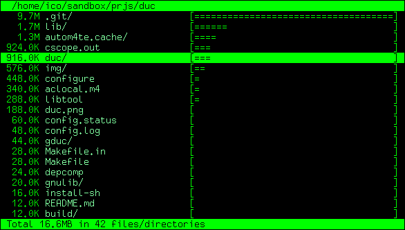

[](https://travis-ci.org/zevv/duc)

 

### Introduction

Duc is a small library and a collection of tools for inspecting and visualizing
disk usage. 

Duc maintains a database of accumulated sizes of directories of your file
system, and allows you to query this database with some tools, or create fancy
graphs showing you where your bytes are.

Duc scales quite well, it has been tested on systems with more then 500 million
files and several petabytes of storage. 

 



### Install

Duc depends on the  database library, and on  and  for writing graphs. 
The ncurses library is required for the curses user interface.

At this time there is no official packaged release for Duc, so you will have to clone the 
git repository and build using autoconf/automake.

Building and installing on Debian or Ubuntu:

```
$ sudo apt-get install libncurses5-dev libcairo2-dev libpango1.0-dev libtokyocabinet-dev libtool autoconf automake build-essential
$ autoreconf --install
$ ./configure
$ make
$ sudo make install
$ sudo ldconfig
```

On RHEL or CentOS systems, you need to do:

```
$ sudo yum install pango-devel cairo-devel tokyocabinet-devel libtool
$ autoreconf --install
$ ./configure
$ make
$ sudo make install
$ sudo ldconfig
```


### Usage

Duc comes with a command line tool called `duc`, which is used to create,
maintain and query the disk usage database.  run `duc help` to get a list of
available commands. `duc help <subcommand>` describes the usage of a specific
subcommand.

Extensive documentation is available in the 


### License

This package is free software; you can redistribute it and/or modify it under
the terms of the GNU General Public License as published by the Free Software
Foundation; version 2 dated June, 1991. This package is distributed in the hope
that it will be useful, but WITHOUT ANY WARRANTY; without even the implied
warranty of MERCHANTABILITY or FITNESS FOR A PARTICULAR PURPOSE. See the GNU
General Public License for more details.

